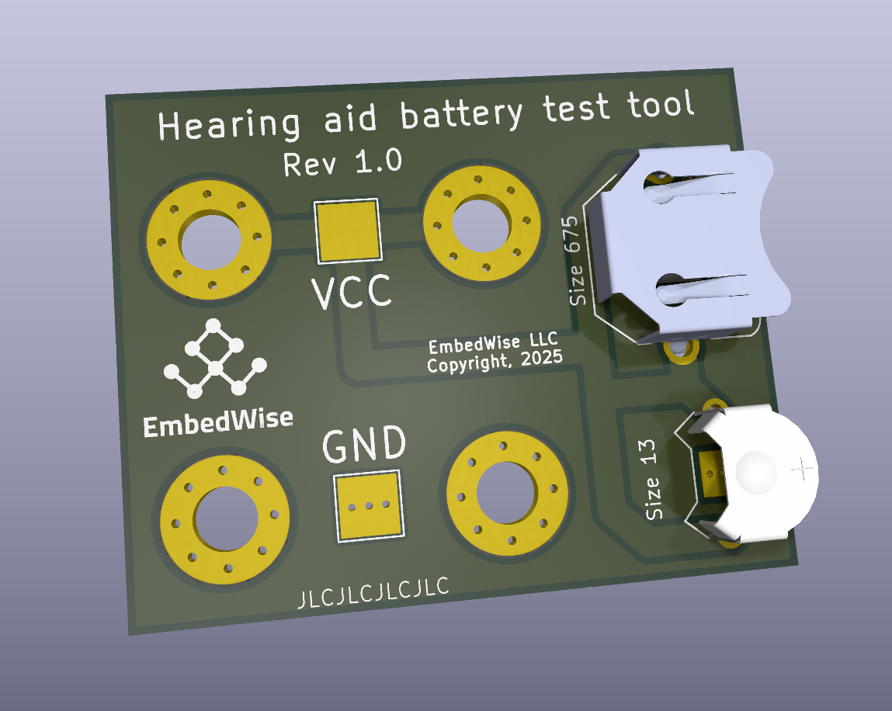

## Hearing aid battery test tool

This repository contains a KiCAD PCB design for a tool to help measure the capacity of Size 675 and Size 13 hearing aid batteries.

The tool is designed to plug into the Input and Sense terminals of benchtop digital multimeters (DMM) and source-measure units (SMU).

Features:
- Sockets for different battery sizes (Size 675, Size 13)
- Standard 0.75" spacing (horizontal and vertical) for through-hole (screw mount) banana plugs.

